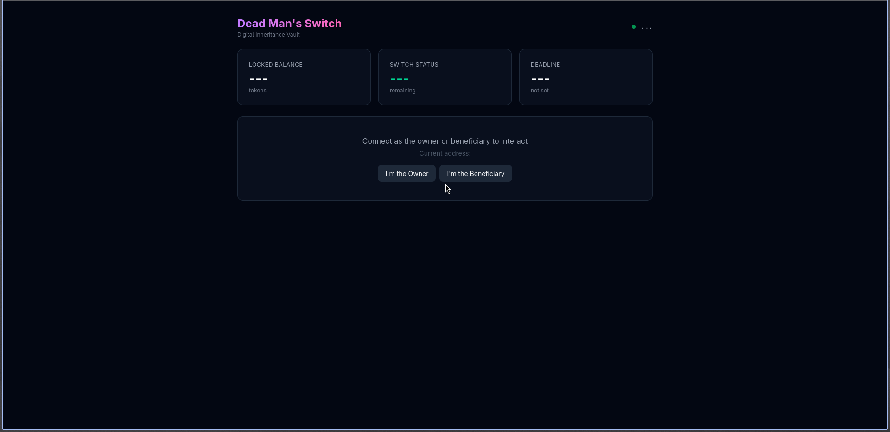
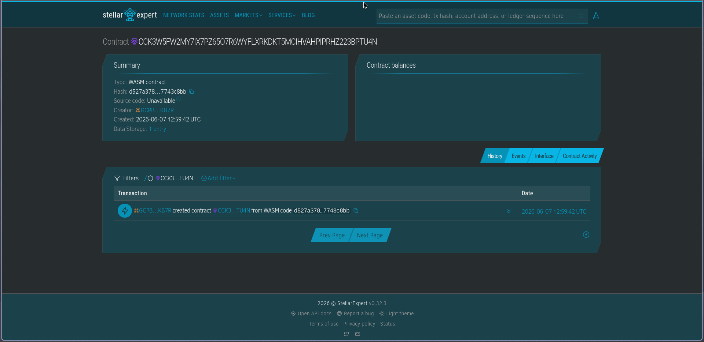

# Soroban Dead Man's Switch (Digital Inheritance Vault)

A trustless, decentralized digital inheritance vault built on the Stellar network using Soroban Smart Contracts (Rust) and a modern React + TypeScript + Tailwind CSS frontend.



## Overview

The **Soroban Dead Man's Switch** provides a secure way to manage digital asset inheritance without relying on centralized third parties, lawyers, or notaries.

- **Asset Owner:** Deposits funds into the contract and must periodically prove they are alive by executing a "ping" function. Each ping extends the security deadline.
- **Beneficiary:** A designated recipient who can claim the entirety of the locked tokens _only if_ the Asset Owner fails to ping the contract before the absolute deadline expires.

---

## Technical Stack

- **Smart Contract Backend:**
  - **Language:** Rust (Stable)
  - **Development Kit:** Soroban SDK (`soroban-sdk` v26)
  - **Execution Target:** WebAssembly (`wasm32v1-none`)
  - **Network Deployment:** Stellar Mainnet / Testnet

- **Frontend Application:**
  - **Framework:** React.js (TypeScript)
  - **Styling:** Tailwind CSS v4 (Modern Dark Theme)
  - **Stellar Client:** `@stellar/stellar-sdk` v12
  - **Wallet Integration:** `@stellar/freighter-api` v3

---

## Smart Contract



### Deployed Contract

| Network       | Contract ID                                                                 |
|---------------|-----------------------------------------------------------------------------|
| Mainnet       | `CCK3W5FW2MY7IX7PZ65O7R6WYFLXRKDKT5MCIHVAHPIPRHZ223BPTU4N` |

### Interface

| Function                | Arguments                                                      | Returns  |
| ----------------------- | -------------------------------------------------------------- | -------- |
| `setup_switch`          | `owner: Address`, `beneficiary: Address`, `token_id: Address`, `timeout: u64` | —        |
| `deposit_funds`         | `amount: i128`                                                 | —        |
| `ping_alive`            | —                                                              | —        |
| `claim_inheritance`     | —                                                              | —        |
| `get_deadline`          | —                                                              | `u64`    |
| `get_contract_balance`  | —                                                              | `i128`   |
| `get_switch_status`     | —                                                              | `u64`    |

### Storage Architecture

```rust
#[contracttype]
pub enum DataKey {
    Owner,           // Address
    Beneficiary,     // Address
    TokenId,         // Address (Stellar Asset Contract)
    TimeoutDuration, // u64 (in seconds)
    Deadline,        // u64 (ledger timestamp)
}
```

---

## Getting Started

### Prerequisites

- [Rust](https://www.rust-lang.org/)
- [Stellar CLI](https://developers.stellar.org/docs/build/smart-contracts/getting-started/setup)
- [Node.js & npm](https://nodejs.org/)
- [Freighter Wallet](https://www.freighter.app/) (Chrome extension)

### Project Structure

```
soroban-dms/
├── Cargo.toml                # Workspace (soroban-sdk = "26")
├── contracts/
│   └── dead-mans-switch/     # Smart contract
│       ├── Cargo.toml
│       └── src/
│           ├── lib.rs        # Contract logic
│           └── test.rs       # Test suite (5 tests)
├── frontend/
│   ├── src/
│   │   ├── App.tsx           # Dashboard UI
│   │   ├── index.css         # Tailwind CSS
│   │   └── hooks/
│   │       ├── useWallet.ts     # Freighter connection
│   │       └── useContract.ts   # Contract interaction
│   ├── contracts/
│   │   ├── contract.ts         # Typed contract bindings
│   │   └── contract.example.ts # Usage example
│   ├── package.json
│   └── .env                  # VITE_CONTRACT_ID=
```

### Smart Contract

```bash
# 1. Run tests
cargo test -p dead-mans-switch

# 2. Build WASM binary
cd frontend
stellar contract build

# 3. Deploy to testnet (gratis)
stellar network add testnet \
  --rpc-url https://soroban-testnet.stellar.org \
  --network-passphrase "Test SDF Network ; September 2015"

stellar keys generate soroban-dms --network testnet
curl "https://friendbot.stellar.org?addr=$(stellar keys address soroban-dms)"
stellar contract deploy --source-account soroban-dms --network testnet

# 4. Deploy to mainnet (butuh XLM real)
stellar network add mainnet \
  --rpc-url https://mainnet.sorobanrpc.com \
  --network-passphrase "Public Global Stellar Network ; September 2015"

stellar keys generate soroban-dms --network mainnet
# Kirim XLM ke alamat di atas, lalu:
stellar contract deploy --source-account soroban-dms --network mainnet
```

### Frontend

```bash
cd frontend
npm install

# Set contract ID
echo "VITE_CONTRACT_ID=CCK3W5FW2MY7IX7PZ65O7R6WYFLXRKDKT5MCIHVAHPIPRHZ223BPTU4N" > .env

# Run dev server
npm run dev
```

---

## User Interface

The dApp conditionally renders two modules depending on the connected wallet role:

- **Owner Dashboard:** Real-time countdown timer, deposit input, and **"I'M ALIVE (PING)"** button.
- **Beneficiary Interface:** **"CLAIM INHERITANCE"** button — disabled until countdown reaches zero.

---

## Security & Guard Rails

- **Authentication Isolation:** `require_auth()` gates prevent unauthorized callers from executing asset draining or deadline tampering.
- **Mathematical Bound Checks:** Timestamps use `u64`, balances use high-precision `i128`.
- **State Corruption Defenses:** One-time initialization with existence check prevents re-initialization.

---

## License

MIT
